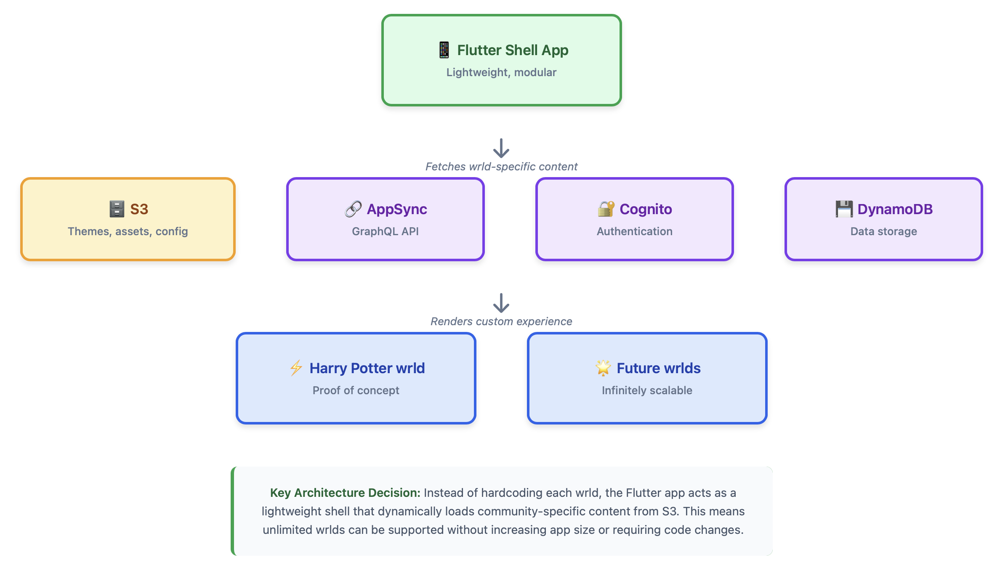

# wrld

A modular social platform that creates custom digital spaces for fandoms. Each wrld is uniquely designed for its community while running on a lightweight, scalable architecture.

## Demo

📹 [Watch the full walkthrough](PLACEHOLDER_LOOM_LINK)

  
  
  

## The Problem

Fandoms need dedicated spaces that reflect their unique identity and culture, but building custom social apps for each community isn't scalable. Generic platforms don't capture the essence of what makes each fandom special, and they're disparately spread out across Reddit, Tumblr, Discord etc.

## The Solution

wrld creates fandom-specific social experiences through a modular architecture. Each wrld has custom branding, content, and features, but they all run on the same lightweight Flutter shell that pulls community-specific assets and configuration from S3.

## Key Features

### Custom Fandom Spaces
- Each wrld is uniquely designed for its community
- Custom themes, branding, and visual identity
- Community-specific content and features
- Proof of concept: Harry Potter wrld fully built and deployed

### Scalable Architecture
- Flutter shell app that adapts to any wrld
- Dynamic content delivery via S3
- Single codebase supports unlimited communities
- Fast deployment of new wrlds without app updates

## Technical Architecture

**Frontend**
- Flutter mobile application
- Modular shell architecture
- Dynamic UI rendering based on wrld configuration

**Backend**
- Custom AWS stack
- AWS Cognito for authentication
- AWS AppSync for GraphQL API
- DynamoDB for data storage
- S3 for dynamic content delivery (themes, assets, configuration)

**API Layer**
- GraphQL API via AWS AppSync
- Real-time data sync capabilities
- Scalable serverless architecture

## Architecture

## The Architecture Evolution

**Initial Approach:** Started by hardcoding the Harry Potter wrld directly into the Flutter app. This worked for a proof of concept but made it clear that building each wrld this way wasn't scalable.

**The Pivot:** Realized the app needed to be a lightweight shell that could adapt to any wrld. Moved all wrld-specific content (themes, assets, configuration) to S3, allowing the Flutter app to dynamically load and render any wrld without code changes.

**The Result:** A single Flutter app that can support unlimited wrlds. Adding a new fandom community is now a content operation, not a development project.

## How It Works

1. User selects or joins a wrld (e.g., Harry Potter)
2. Flutter app fetches wrld configuration from S3
3. App dynamically loads wrld-specific themes, assets, and features
4. User experiences a fully customized social space
5. All interactions sync via GraphQL API to DynamoDB

## Technical Challenges Solved

**Keeping the App Lightweight:** The core challenge was preventing the app from bloating as more wrlds were added. Solution: Move everything wrld-specific to S3, keep the Flutter app as a thin rendering layer.

**Dynamic Theming:** Built a theming system that could adapt the entire UI based on wrld configuration, allowing each community to have a distinct visual identity without separate codebases.

**Scalable Content Delivery:** S3 provides fast, reliable content delivery at scale. New wrlds can be deployed by uploading assets and configuration files, with no app store review required.

**State Management:** Managing the dynamic nature of wrlds required careful state management to ensure smooth transitions and consistent user experience across different communities.

## Project Status

Built as an exploration of modular social platforms. Harry Potter wrld fully implemented as proof of concept demonstrating the architecture's viability.

**Note:** This is a demonstration project not currently accepting users.

## Why This Architecture Matters

Traditional approach: Build separate apps for each community → expensive, slow, not scalable

wrld approach: One shell app + dynamic content → unlimited communities, fast deployment, highly scalable

This architecture pattern could support hundreds of fandom communities without additional app development, making it viable as a platform business.

## Tech Stack Summary

- **Mobile:** Flutter
- **Backend:** AWS (Cognito, AppSync, DynamoDB, S3)
- **API:** GraphQL via AWS AppSync
- **Content Delivery:** S3
- **Authentication:** AWS Cognito

---

Built by [Hannah Kingswood](https://github.com/HT1994378)
